# lego_world_map
Code inspired from a project by [Milan Janosov](https://www.linkedin.com/in/milan-janosov/) to create a stylized elevation map of the world.

You can read about his work creating a Lego elevation map of Budapest [here](https://open.substack.com/pub/milanjanosov/p/lego-elevation-map?r=3mp6w8&utm_medium=ios) on his Substack.

Lego has previously made a world map (see below), but I think I could do a little better!

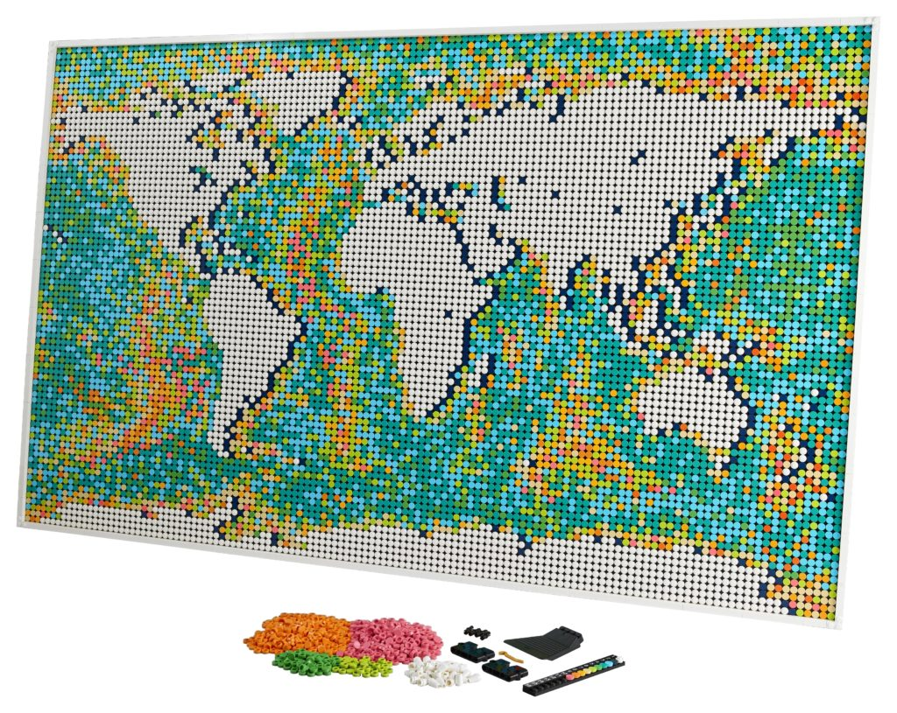

## Overview

## Table of Contents

[Downloading DEMs](#dem)  
[Merging DEMs](#merge)  
[Create Grid](#grid)  
[Map Elevation Per Grid Cell](#calc)  
[Discretize Elevation into Bins](#disc_elev)  
[Quantize Surface Color into Bins](#disc_color)  
[Discretize color image and make patches for building](#patches)  
  [Resize image and apply grid](#resize)  
  [Overview of the patches](#over)  
  [Save patches](#save)  
[Future project goals](#future)  
[Project challenges](#challenges)

## Downloading DEMs

I went to USGS' [EarthExplorer](https://earthexplorer.usgs.gov) to download all the GeoTIFF tiles from the [Global 30 Arc-Second Elevation (GTOPO30)](https://www.usgs.gov/centers/eros/science/usgs-eros-archive-digital-elevation-global-30-arc-second-elevation-gtopo30?qt-science_center_objects=0#qt-science_center_objects) dataset:

I manually downloaded all 33 tiles in the dataset. Here's an example of what the raw GeoTiff looks like:

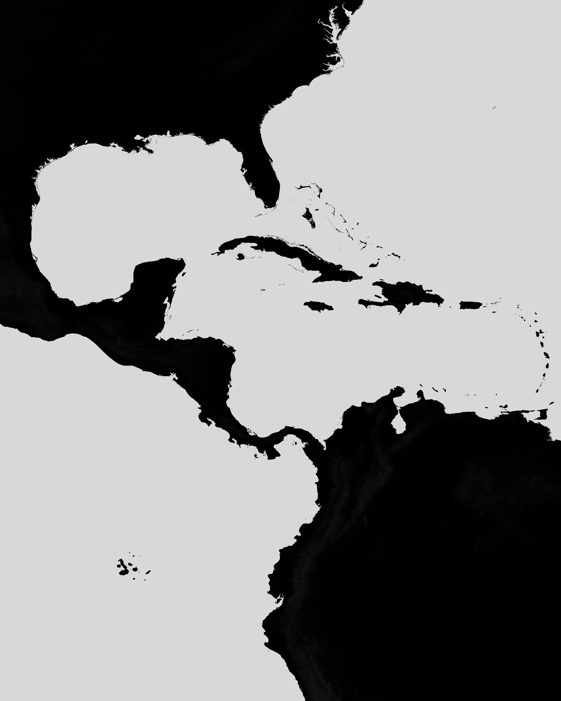

## Merging DEMs

The challenge here was finding the right process to merge the DEMs, as each one was on the order of 50 MB. What worked was to [create a VRT](https://gdal.org/en/latest/programs/gdalbuildvrt.html), or Virtual Raster Table from the GDAL library, which helps relieve the memory burden for the system.

Using matplotlib, it was easy to save the resulting .tif file as a JPG for pretty viewing:

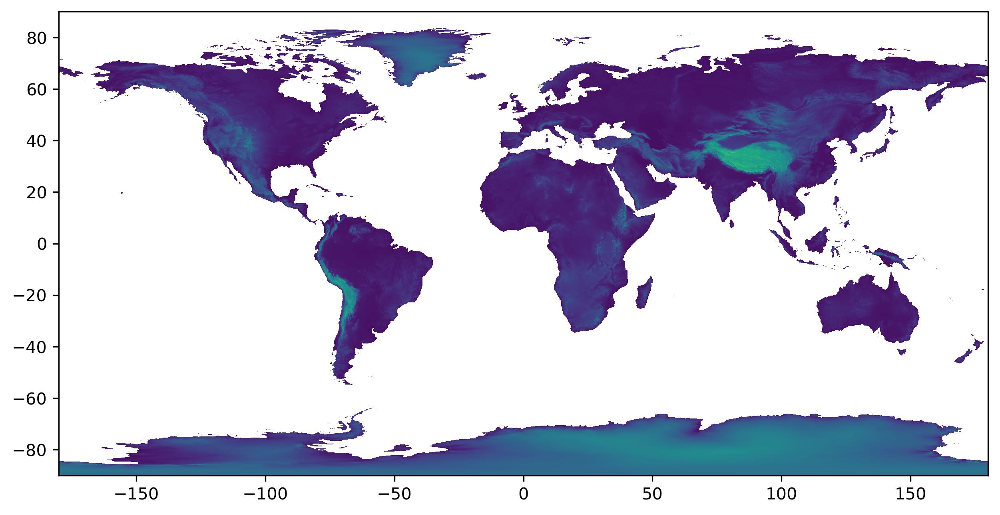

## Create Grid

Now we have to rasterize the elevation map. This is crucial as we'll be eventually making this map in Lego, which are bricks (duh).

We need to have a look at the boundaries of the world. I have a file downloaded already. Since the file has an entry for every country, we will get distracting boundary lines in our polygon. Using the `union_all` method, I can merge all the polygons into a single massive polygon. Let's take a look at the result:

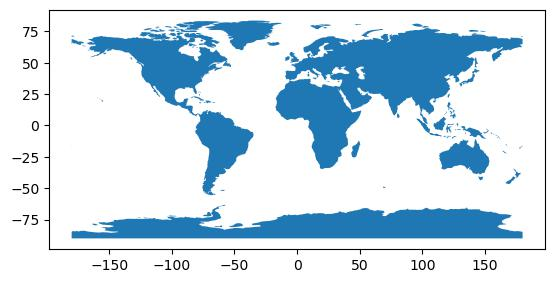

We'll have to figure out what the dimensions of the Lego set are (in Lego studs), as that is a good reference size for our eventual Lego map.
* The map is 5 x 16 or 80 studs in height and
* 8 x 16 or 128 studs in width

Using a function from Milan, we can create a grid over the polygon. Let's look at the contiguous USA:

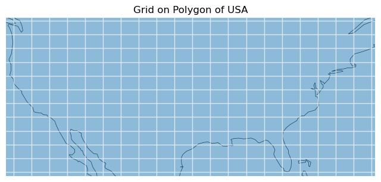

## Map Elevation Per Grid Cell

Using zonal statistics, I calculated the mean elevation for each grid cell.

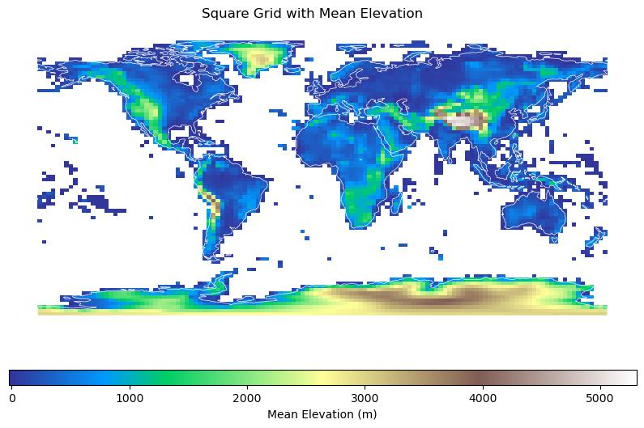

## Discretize Elevation

Here, I've shown 7 bins of elevation using the quantile binning method that allows for roughly equal representation of the amount of data into each bin.

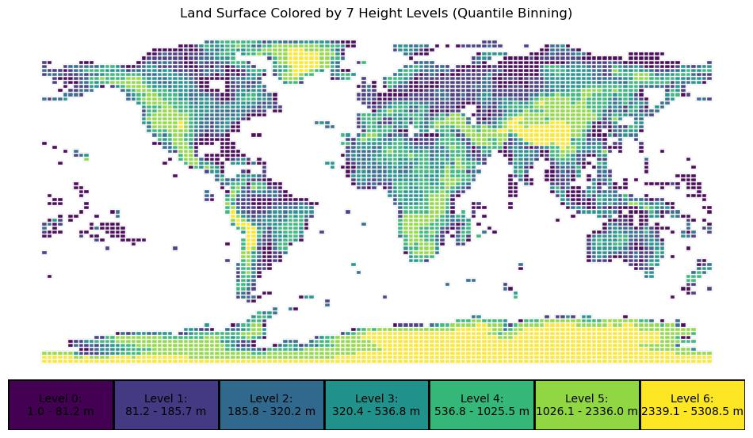

## Quantize Color

We all know maps with the surface color of Earth, like this:

### 
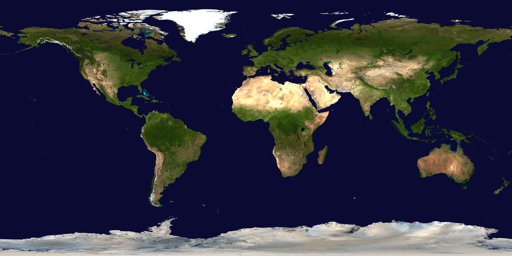

But that file has over 200,000 individual colors, waaay more than what Lego possesses. I first brightened the image and then used the median cut algorithm to lower the colorspace of the image down to 12 colors. You'll notice that half the colors are of the blue ocean, but that's ok. The important thing is to have enough colors to make the land surface interesting.

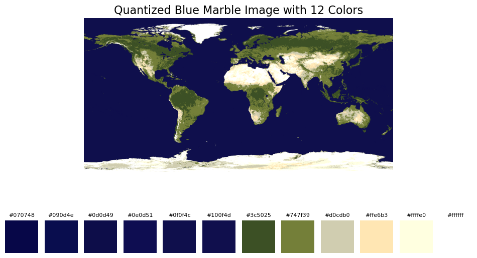

## Discretize surface color, make patches for building the lego

### Resize image and apply grid

I resized the image to be 160 units by 80 units becuase that was faithful to the [Blue Marble](#bluemarble) image. I also plotted the colors contained within the image, which would be helpful for someone actually building the map:

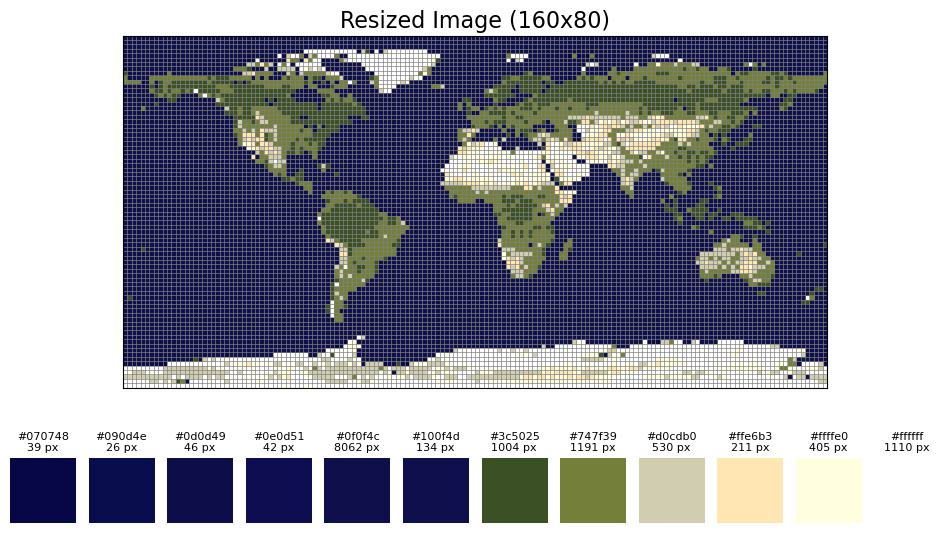

### Overview of the patches

I created an image with a "patched" version of the map to show all 50 patches needed to build the map:

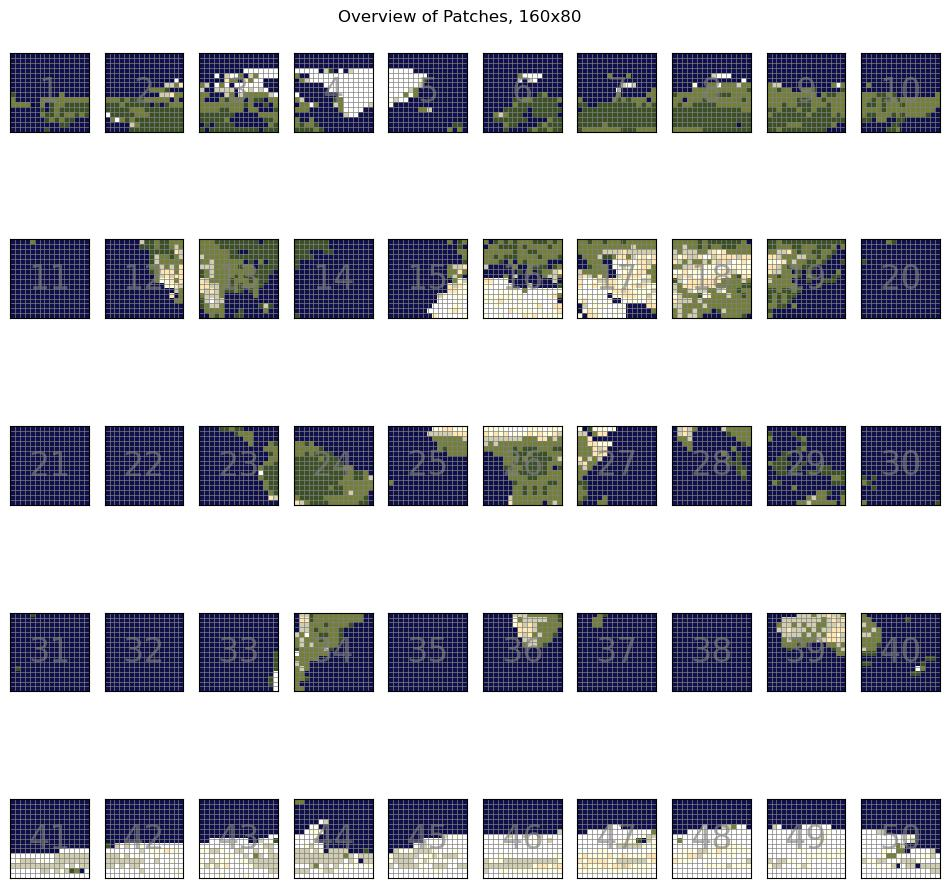

### Save patches

I saved the patches for future use. Here is what a single patch looks like:

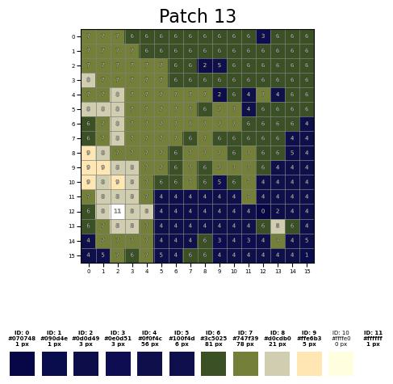

And that completes the project! 

Now where did that last Lego piece go...

## Future Project Goals

[] Make the work into a function
[] Post it to my website so others can make their own maps

## Project Challenges and Solutions

* **Challenge**: How to merge DEMs without overloading system memory?
  > **Solution**: Use virtual raster tables
* **Challenge**: Artifacts appear when resizing the DEM
  > **Solution**: First troubleshoot on which layer (DEM, world shoreline polygon, etc.) is giving me trouble, then...
